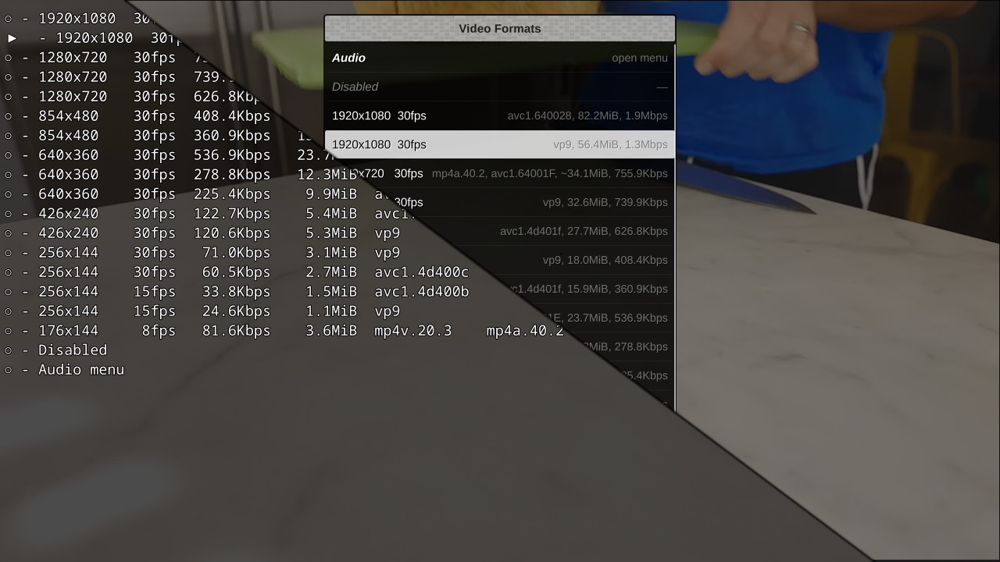

# quality-menu
A userscript for MPV that allows you to change the streamed video and audio quality (ytdl-format) on the fly.

Simply open the video or audio menu, select your prefered format and confirm your choice. The keybindings for opening the menus are configured in input.conf, and everthing else is configured in quality-menu.conf.

Note: Version 4.2.0 and later require mpv 0.39.0. Anyone on an older version of mpv can use version 4.1.2 instead.



## Features

- Currently playing format is marked and selected when opening the menu
- Remembers selected format for every url in the current session (e.g. going back to previous playlist item automatically selects the prefered format)
- Controllable entirely by mouse or keyboard (opening by mouse requires either the OSC extension, [uosc](https://github.com/tomasklaen/uosc) or an additional entry in [`input.conf`](https://mpv.io/manual/stable/#input-conf))
- All format related information from yt-dlp/youtube-dl can be shown
- Columns that are identical for all formats are automatically hidden
- Formats can be sorted based on resolution, fps, bitrate, etc.
- Simple reload functionality
- Columns and their order are configurable
- **(optional)** Graphical menu via [uosc](https://github.com/tomasklaen/uosc) integration  
    Note: Requires uosc 5.0.0 or newer.

## OSC extension
**(optional)** An extended version of the OSC is available that includes a button to display the quality menu.


**PLEASE NOTE:** This conflicts with other scripts that modify the OSC. Merging this OSC modification others is certainly possible. Depending on how the osc is modified, the [osc.patch](osc.patch) might apply cleanly, but you have to make sure the filename in the patch lines up with the filename of your files.

## Installation
1. Save the `quality-menu.lua` into your [scripts directory](https://mpv.io/manual/stable/#script-location)
2. Set key bindings in [`input.conf`](https://mpv.io/manual/stable/#input-conf)
    ```
    F     script-binding quality_menu/video_formats_toggle
    Alt+f script-binding quality_menu/audio_formats_toggle
    ```
    **(optional)** `Ctrl+r script-binding quality_menu/reload`

3. **(optional)** Save the `quality-menu.conf` into your `script-opts` directory (next to the [scripts directory](https://mpv.io/manual/stable/#script-location), create if it doesn't exist)
4. **(optional)** UI integration (pick one)
    - For OSC: Save the `quality-menu-osc.lua` into your [scripts directory](https://mpv.io/manual/stable/#script-location)  and put `osc=no` in your [mpv.conf](https://mpv.io/manual/stable/#location-and-syntax)
    - For [uosc](https://github.com/tomasklaen/uosc) (each is optional)
        1. Add the video and audio menu to the uosc menu by appending `#! ...` to your key bindings in [`input.conf`](https://mpv.io/manual/stable/#input-conf)
        ```
        F     script-binding quality_menu/video_formats_toggle #! Stream Quality > Video
        Alt+f script-binding quality_menu/audio_formats_toggle #! Stream Quality > Audio
        ```
        2. quality-menu already overwrites the builtin uosc command `stream-quality`, so it already works well out of the box.
            For even deeper UI integration you can add buttons to the `contols=` option in your [`uosc.conf`](https://github.com/tomasklaen/uosc/blob/main/script-opts/uosc.conf)
            1. `<!has_many_video,video,stream>command:theaters:script-binding quality_menu/video_formats_toggle#@vformats>1?Video`
            2. `<!has_many_audio,has_audio,stream>command:graphic_eq:script-binding quality_menu/audio_formats_toggle#@aformats>1?Audio`

## Plans For Future Enhancement
- [x] Visual indication of what the current quality level is
- [x] Option to populate the quality list automatically with the exact formats available for a given video
- [x] Optional OSC extension
- [x] [uosc](https://github.com/tomasklaen/uosc) integration
- [ ] *\[your suggestion here\]*

## Credit
- [reload.lua](https://github.com/4e6/mpv-reload/), for the function to reload a video while preserving the playlist.
- [mpv-playlistmanager](https://github.com/jonniek/mpv-playlistmanager), for the menu formatting config.
- ytdl_hook.lua, much of the  code to fetch the format list with youtube-dl came from there.
- somebody on /mpv/ for the idea
